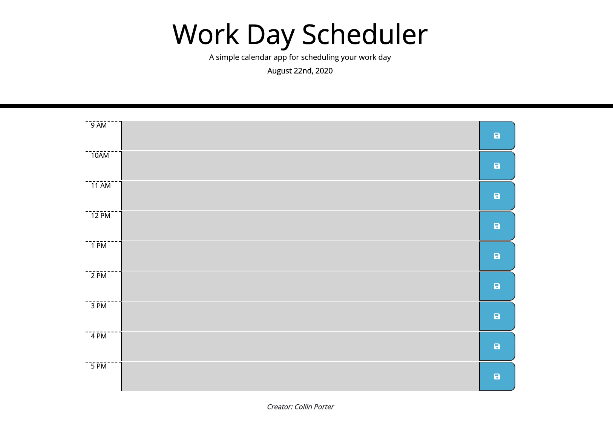

# Work Day Scheduler

This application was built by me and it allows the user to input data into a text area that persists when the page refreshes. The text areas are also color-coded which tells the user if the text area/data is in the past, present or future.

1. User clicks in a text area and inputs data they want to save by clicking the save button.
2. The color of the text area will indicate whether that text area is the past hour, present hour or future hour.
3. When the user clicks save, the data persists and will show even when the page is refreshed.
4. The user can delete their data when the task is completed or leave it and based off of the hour of the day it will become a "past task".

Link to live site: [Work Day Scheduler](https://portercol.github.io/Work-Day-Scheduler/)

# Credits

1. Bootstrap CDN
2. jQuery CDN
3. moment.js CDN
4. Peers from study groups + TA's/Tutors
5. GOOGLE!!
